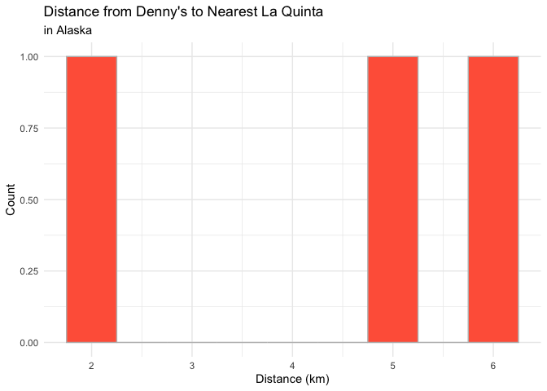
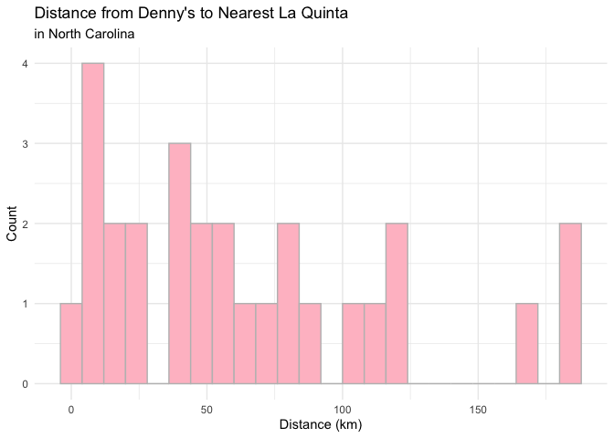

Lab 05 - La Quinta is Spanish for next to Denny’s, Pt. 2
================
Lily Botha
02/17/2026

### Load packages and data

``` r
library(tidyverse) 
library(dsbox) 
library(readr)
```

``` r
states <- read_csv("data/states.csv")
dn <- read_csv("https://github.com/DataScience4Psych/DataScience4Psych/raw/main/data/raw-data/dennys.csv")
lq <- read_csv("https://github.com/DataScience4Psych/DataScience4Psych/raw/main/data/raw-data/laquinta.csv")
```

### Exercise 1

There are 3 Denny’s locations in Alaska.

``` r
dn_ak <- dn %>%
  filter(state == "AK")
nrow(dn_ak)
```

    ## [1] 3

There are 2 La Quinta locations in Alaska.

``` r
lq_ak <- lq %>% 
  filter(state == "AK")
nrow(lq_ak)
```

    ## [1] 2

### Exercise 2

There are 6 pairings between all Denny’s and all La Quinta locations in
Alaska, so we need to calculate 6 distances.

``` r
nrow(dn_ak) * nrow(lq_ak)
```

    ## [1] 6

### Exercise 3

``` r
dn_lq_ak <- full_join(dn_ak, lq_ak, #use full_join to keep all rows and columns from both dfs
  by = "state"
)
```

    ## Warning in full_join(dn_ak, lq_ak, by = "state"): Detected an unexpected many-to-many relationship between `x` and `y`.
    ## ℹ Row 1 of `x` matches multiple rows in `y`.
    ## ℹ Row 1 of `y` matches multiple rows in `x`.
    ## ℹ If a many-to-many relationship is expected, set `relationship =
    ##   "many-to-many"` to silence this warning.

``` r
dn_lq_ak
```

    ## # A tibble: 6 × 11
    ##   address.x     city.x state zip.x longitude.x latitude.x address.y city.y zip.y
    ##   <chr>         <chr>  <chr> <chr>       <dbl>      <dbl> <chr>     <chr>  <chr>
    ## 1 2900 Denali   Ancho… AK    99503       -150.       61.2 3501 Min… Ancho… 99503
    ## 2 2900 Denali   Ancho… AK    99503       -150.       61.2 4920 Dal… Fairb… 99709
    ## 3 3850 Debarr … Ancho… AK    99508       -150.       61.2 3501 Min… Ancho… 99503
    ## 4 3850 Debarr … Ancho… AK    99508       -150.       61.2 4920 Dal… Fairb… 99709
    ## 5 1929 Airport… Fairb… AK    99701       -148.       64.8 3501 Min… Ancho… 99503
    ## 6 1929 Airport… Fairb… AK    99701       -148.       64.8 4920 Dal… Fairb… 99709
    ## # ℹ 2 more variables: longitude.y <dbl>, latitude.y <dbl>

### Exercise 4

There are 6 observations in the joined dn_lq_ak data frame. The names of
the variables are: address.x, city.x, state, zip.x, longitude.x,
latitude.x, address.y, city.y, zip.y, longitude.y, and latitude.y.

``` r
nrow(dn_lq_ak)
```

    ## [1] 6

``` r
colnames(dn_lq_ak)
```

    ##  [1] "address.x"   "city.x"      "state"       "zip.x"       "longitude.x"
    ##  [6] "latitude.x"  "address.y"   "city.y"      "zip.y"       "longitude.y"
    ## [11] "latitude.y"

### Exercise 5

The mutate function is used to add a new variable to a data frame while
keeping the existing variables.

``` r
haversine <- function(long1, lat1, long2, lat2, round = 3) {
  # convert to radians
  long1 <- long1 * pi / 180
  lat1 <- lat1 * pi / 180
  long2 <- long2 * pi / 180
  lat2 <- lat2 * pi / 180

  R <- 6371 # Earth mean radius in km

  a <- sin((lat2 - lat1) / 2)^2 + cos(lat1) * cos(lat2) * sin((long2 - long1) / 2)^2
  d <- R * 2 * asin(sqrt(a))

  return(round(d, round)) # distance in km
}
```

### Exercise 6

``` r
dn_lq_ak <- dn_lq_ak %>%
  mutate(distance = haversine(long1 = longitude.x, lat1 = latitude.x, long2 = longitude.y, lat2 = latitude.y)) #add a distance variable using the haversine function
```

### Exercise 7

``` r
dn_lq_ak_mindist <- dn_lq_ak %>% 
  group_by(address.x) %>% #group by Denny's locations
  mutate(distance = haversine(longitude.x, latitude.x, longitude.y, latitude.y)) %>% #calc minimum distance btwn a Denny's and La Quinta for each Denny's location. NTS: can just type the variables, don't need to add "long1 = ..."
  summarize(closest = min(distance))

dn_lq_ak_mindist #print df on separate line
```

    ## # A tibble: 3 × 2
    ##   address.x        closest
    ##   <chr>              <dbl>
    ## 1 1929 Airport Way    5.20
    ## 2 2900 Denali         2.04
    ## 3 3850 Debarr Road    6.00

### Exercise 8

There are 3 Denny’s locations in Alaska. The distances range from 2 -
5.9 km, with a median of 5.1 km and a mean of 4.4 km. The distribution
is slightly left skewed, meaning most locations are fairly close
together with one slightly smaller distance. The standard deviation is
about 2 km, which means there is very little variability in distances.

``` r
summary(dn_lq_ak_mindist$closest)
```

    ##    Min. 1st Qu.  Median    Mean 3rd Qu.    Max. 
    ##   2.035   3.616   5.197   4.410   5.598   5.998

``` r
sd(dn_lq_ak_mindist$closest)
```

    ## [1] 2.09544

``` r
dn_lq_ak_mindist %>% 
  ggplot(aes(x = closest)) +
  geom_histogram(binwidth = .5, fill = "tomato", color = "grey") +
  labs(
    title = "Distance from Denny's to Nearest La Quinta",
    subtitle = "in Alaska",
    x = "Distance (km)", 
    y = "Count"
  ) +
  theme_minimal()
```

<!-- -->

### Exercise 9

The distances between Denny’s locations and their closest La Quinta’s in
North Carolina range from 1.7 - 187.9 km, with a median of 53.4 km and a
mean of 65.4 km. The distribution is right skewed, meaning many Denny’s
are moderately close to a La Quinta, but a few locations are much
farther away. The large standard deviation of 53.4 km means there is
substantial variability in distances.

``` r
#filter dn and lq for NC
dn_nc <- dn %>% filter(state == "NC")
lq_nc <- lq %>% filter(state == "NC")

#join df to get complete list of all possible pairings
dn_lq_nc <- full_join(dn_nc, lq_nc, by = "state")
```

    ## Warning in full_join(dn_nc, lq_nc, by = "state"): Detected an unexpected many-to-many relationship between `x` and `y`.
    ## ℹ Row 1 of `x` matches multiple rows in `y`.
    ## ℹ Row 1 of `y` matches multiple rows in `x`.
    ## ℹ If a many-to-many relationship is expected, set `relationship =
    ##   "many-to-many"` to silence this warning.

``` r
#calculate all distances and minimum distance per Denny's
dn_lq_nc_mindist <- dn_lq_nc %>%
  mutate(distance = haversine(longitude.x, latitude.x, longitude.y, latitude.y)) %>% 
  group_by(address.x) %>% 
  summarise(closest = min(distance))

#summary stats
summary(dn_lq_nc_mindist$closest)
```

    ##    Min. 1st Qu.  Median    Mean 3rd Qu.    Max. 
    ##   1.779  22.388  53.456  65.444  93.985 187.935

``` r
sd(dn_lq_nc_mindist$closest)
```

    ## [1] 53.42398

``` r
#plot
dn_lq_nc_mindist %>% 
  ggplot(aes(x = closest)) +
  geom_histogram(binwidth = 8, fill = "pink", color = "grey") +
  labs(
    title = "Distance from Denny's to Nearest La Quinta",
    subtitle = "in North Carolina",
    x = "Distance (km)",
    y = "Count"
  ) +
  theme_minimal()
```

<!-- -->

### Exercise 10

The distances between Denny’s locations and their nearest La Quinta’s in
Texas range from 0.01 - 60 km, with a median of 3.3 km and a mean of 5.7
km. The distribution is right skewed, meaning most Denny’s are very
close to a La Quinta, but a few locations are farther away. The standard
deviation is 8.8 km, meaning there is moderate variability in distances.

``` r
#filter dn and lq for TX
dn_tx <- dn %>% filter(state == "TX")
lq_tx <- lq %>% filter(state == "TX")

#join df to get complete list of all possible pairings
dn_lq_tx <- full_join(dn_tx, lq_tx, by = "state")
```

    ## Warning in full_join(dn_tx, lq_tx, by = "state"): Detected an unexpected many-to-many relationship between `x` and `y`.
    ## ℹ Row 1 of `x` matches multiple rows in `y`.
    ## ℹ Row 1 of `y` matches multiple rows in `x`.
    ## ℹ If a many-to-many relationship is expected, set `relationship =
    ##   "many-to-many"` to silence this warning.

``` r
#calculate all distances and minimum distance per Denny's
dn_lq_tx_mindist <- dn_lq_tx %>%
  mutate(distance = haversine(longitude.x, latitude.x, longitude.y, latitude.y)) %>% 
  group_by(address.x) %>% 
  summarise(closest = min(distance))

#summary stats
summary(dn_lq_tx_mindist$closest)
```

    ##    Min. 1st Qu.  Median    Mean 3rd Qu.    Max. 
    ##  0.0160  0.7305  3.3715  5.7918  6.6303 60.5820

``` r
sd(dn_lq_tx_mindist$closest)
```

    ## [1] 8.830715

``` r
#plot
dn_lq_tx_mindist %>% 
  ggplot(aes(x = closest)) +
  geom_histogram(binwidth = 2, fill = "blue", color = "grey") +
  labs(
    title = "Distance from Denny's to Nearest La Quinta",
    subtitle = "in Texas",
    x = "Distance (km)",
    y = "Count"
  ) +
  theme_minimal()
```

<!-- -->

### Exercise 11

### Exercise 12
